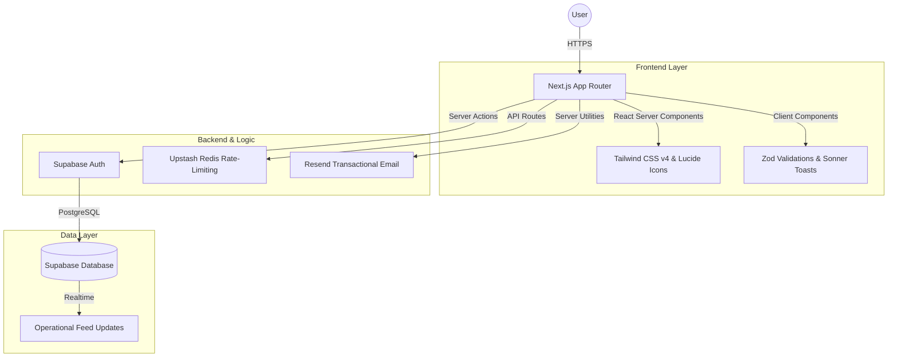

# IIMS IT Club Portal

## 📸 Preview


> Note: A live preview of the interactive landing page. [Visit Live Site](https://club-portal-eight.vercel.app/)

## Project Overview

The comprehensive web platform for the IIMS IT Club. This repository serves as the central hub for our community, offering public-facing insights into our operations, events, and a secure administrative portal for member management and feed updates. The platform is designed to prioritize performance, security, and a modern aesthetic design architecture.

## 🏗️ Architecture



## Architecture and Technologies

- **Core Framework:** Next.js (App Router) with React
- **Language:** TypeScript
- **Styling:** Tailwind CSS (v4) for utility-first, highly responsive design systems.
- **Database & Authentication:** Supabase (PostgreSQL Database, Auth-Helpers, SSR).
- **Security & Caching:** Upstash Redis for server-side rate-limiting and performance caching.
- **Communications:** Resend integration for transactional email flows.
- **Utilities & Design:** 
  - `zod` for strict schema validation
  - `lucide-react` for consistent iconography
  - `sonner` for non-intrusive toast notifications
  - `react-markdown` for content rendering

## Directory Structure

- `app/ (public)`: Public-facing routes such as landing pages, team overviews, and membership applications.
- `app/portal (protected)`: Secure administrative routes requiring Supabase authentication. Includes member management and the operational feed.
- `app/api`: Server-side API routes, including integrations for Upstash rate limiting and Supabase queries.
- `components/`: Reusable React components organized by feature and layout domains.

## Environment Variables

To run this project locally, create a `.env.local` file at the root of the project with the following required variables:

```env
# Supabase Configuration
NEXT_PUBLIC_SUPABASE_URL=your_supabase_project_url
NEXT_PUBLIC_SUPABASE_ANON_KEY=your_supabase_anon_key
SUPABASE_SERVICE_ROLE_KEY=your_supabase_service_role_key

# Upstash Redis Configuration
UPSTASH_REDIS_REST_URL=your_upstash_redis_url
UPSTASH_REDIS_REST_TOKEN=your_upstash_redis_token

# Resend Mail Configuration
RESEND_API_KEY=your_resend_api_key
```

## Local Development Setup

1. Clone the repository to your local machine.
2. Install dependencies using your preferred package manager:
   ```bash
   npm install
   ```
3. Ensure your environment variables are configured.
4. Start the development server:
   ```bash
   npm run dev
   ```
5. Navigate to `http://localhost:3000` in your browser.

## Deployment

This platform is optimized for deployment on Vercel. Ensure all environment variables are securely added to your Vercel project settings prior to initiating a deployment build. The build command relies on the standard `next build` process.

## Security Considerations

- All API routes mutating or viewing sensitive data must enforce Supabase session verification.
- Publicly accessible mutation endpoints (e.g., Contact forms, Join applications) are shielded by Upstash rate-limiting to mitigate automated attacks.
- Component designs must strictly adhere to sanitizing user-generated markdown inputs via `react-markdown` and associated plugins.

---
© 2026 Sujal Mainali | [MIT License](LICENSE)
